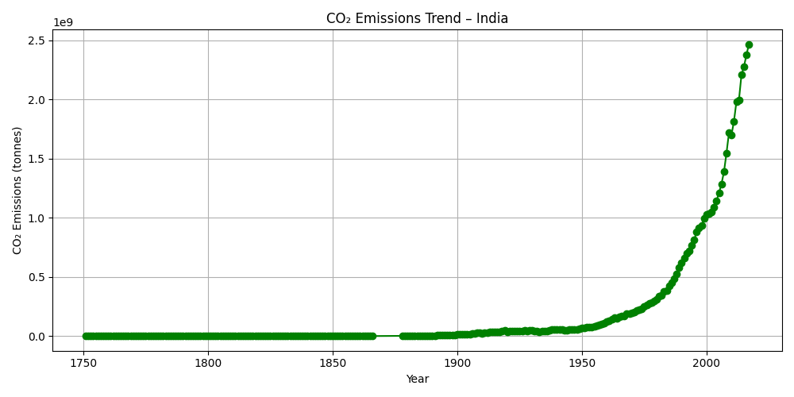
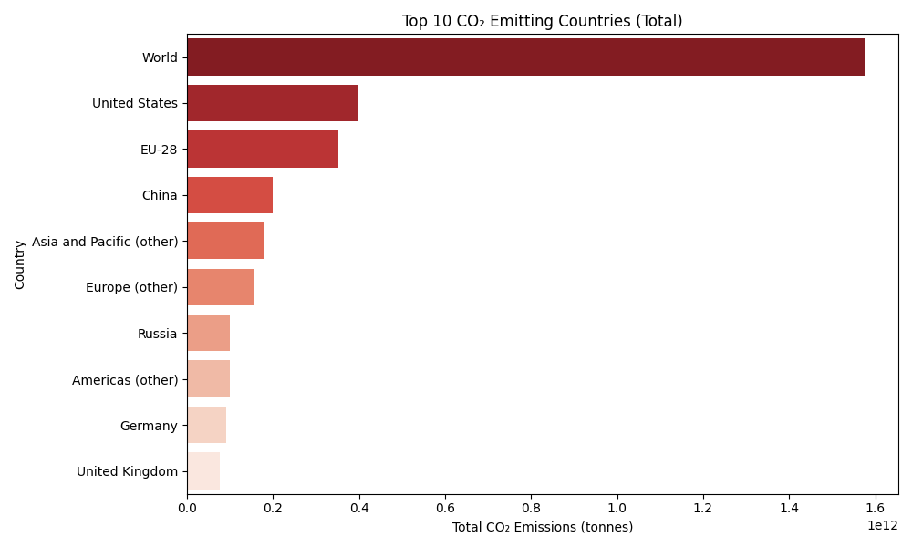

# 🌍 Global CO₂ Emissions Analysis Project

**A data-driven project analyzing global CO₂ emissions trends, built using Python and Excel as part of a data internship task for Brainalyst. Includes dashboard, insights, strategic recommendations, and report generation.**

---

## 📘 Repository Description

This repository contains all project files related to the analysis of CO₂ emissions data across countries from 2000 to 2022. It includes the original dataset, data cleaning scripts, Excel dashboard, PowerPoint presentation, a 1-year business strategy plan for Brainalyst, and a README for documentation.

It demonstrates real-world data handling, dashboard creation, visualization, insight extraction, and business communication — ideal for data analyst or business analyst portfolio work.

---

## 📊 Project Summary

- **Goal:** Analyze historical CO₂ emission trends and identify top emitters
- **Tools Used:** Python (pandas, matplotlib, seaborn), Microsoft Excel, PowerPoint, FPDF
- **Deliverables:** Dashboard, Presentation, Strategy Plan, Visualizations

---

## 📁 Folder Structure

```
CO2-Emissions-Analysis/
├── co2_emission.csv
├── co2_analysis.py
├── CO2_Emissions_Dashboard.xlsx
├── CO2_Emissions_Presentation.pptx
├── Brainalyst_1_Year_Growth_Strategy.pdf
├── README.md
└── images/
    ├── india_emissions_trend.png
    └── top_emitters.png
```

---

## 📈 Key Insights

- India's CO₂ emissions increased significantly post-2000
- China and the US are the largest contributors globally
- Developed nations show a slowing trend, indicating stronger regulations
- Useful for policymakers, climate advocates, and EdTech use cases

---

## 📷 Dashboard Visuals

**India's CO₂ Emissions Over Time**  


**Top 10 Emitting Countries (2000–2022)**  


---

## 🧠 Strategy Add-on (Task 2)

This project includes a one-year strategic plan to grow Brainalyst’s college presence through digital storytelling, ambassador programs, and phased execution targeting Tier-2 campuses.

---

## ▶️ How to Run This Project

1. Clone the repo and open in VS Code or your preferred IDE
2. Install the requirements:
   ```
   pip install pandas matplotlib seaborn openpyxl fpdf
   ```
3. Run:
   ```bash
   python co2_analysis.py
   ```
   This will generate:
   - Excel dashboard
   - CO₂ trend charts
   - PDF strategy plan

---

## 💡 Author

**Rojins S Martin**  
3rd Year IT Engineering | Data | Design | Strategy  
[LinkedIn](www.linkedin.com/in/rojinssmartin) • [Portfolio](https://yourportfolio.com)
